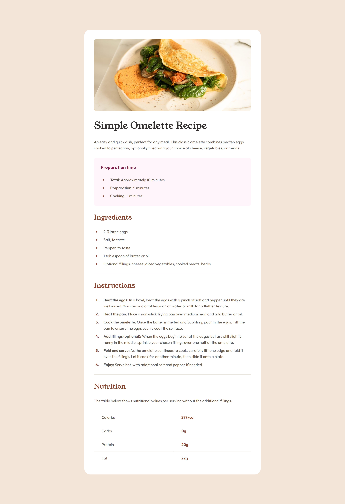

# Frontend Mentor - Recipe page solution

This is a solution to the [Recipe page challenge on Frontend Mentor](https://www.frontendmentor.io/challenges/recipe-page-KiTsR8QQKm). Frontend Mentor challenges help you improve your coding skills by building realistic projects.

## Overview

### Screenshot

### Links

- [Solution URL](https://www.frontendmentor.io/solutions/omellete-recipe-page-odfB4jQ1pW)
- [Live Site URL](https://jbidz.github.io/recipe-page/)

## My process

### Built with

- Semantic HTML5 markup
- CSS custom properties
- Flexbox
- CSS Grid
- Mobile-first workflow
- HTML Table

## Author

- Frontend Mentor - [@bidz](https://www.frontendmentor.io/profile/jbidz)
